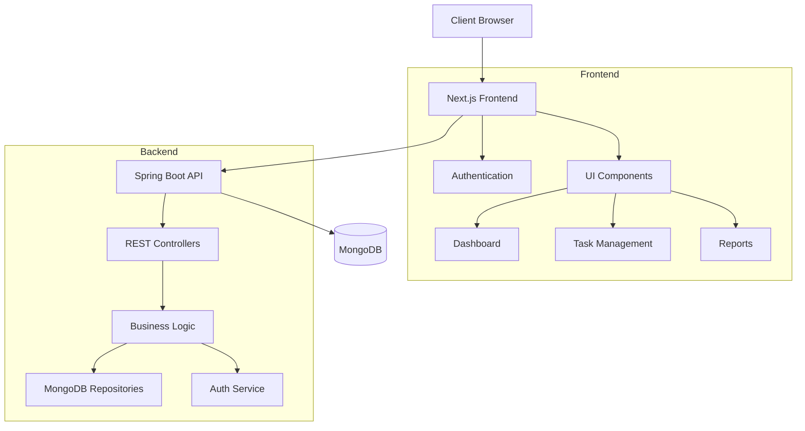
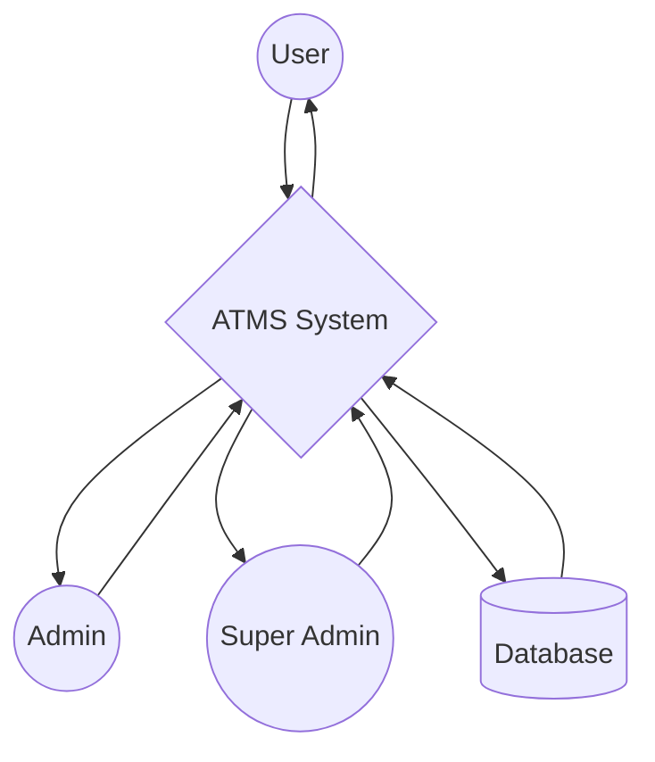
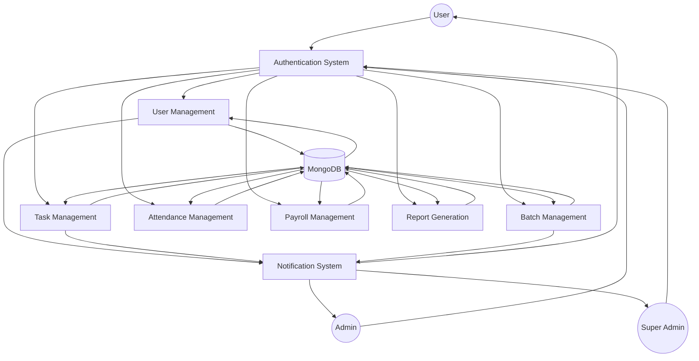
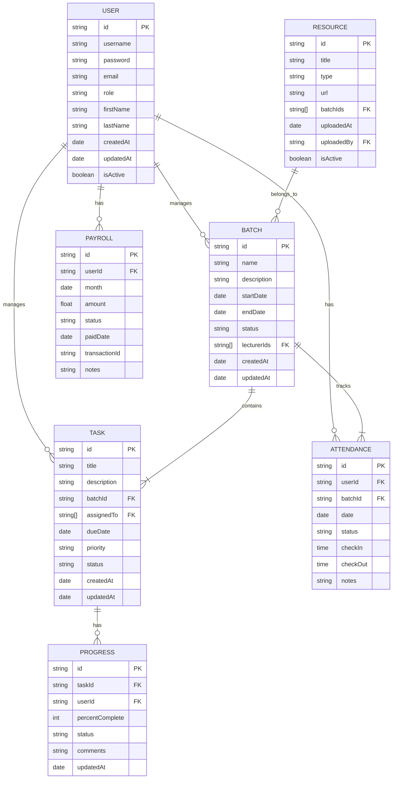
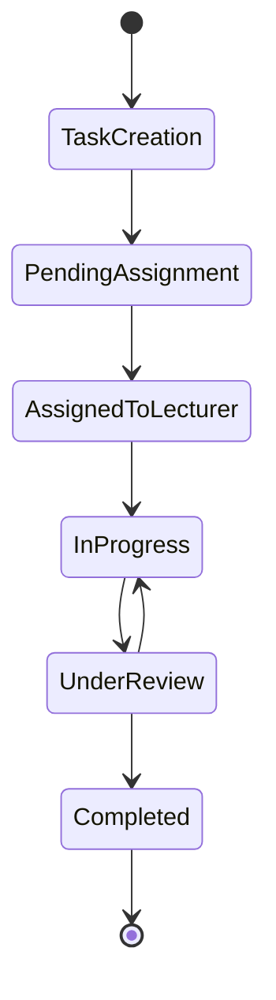
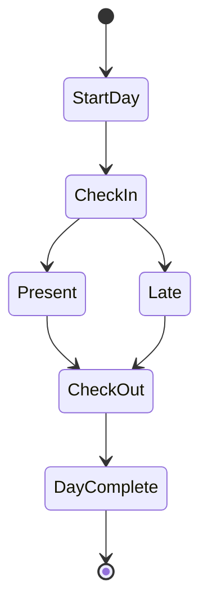

# ATMS (Academics Team Management System)

A full-stack task management application built with Spring Boot and Next.js, featuring a modern UI and robust backend architecture.

## Tech Stack

### Backend
- Java Spring Boot
- MongoDB (with auditing enabled)
- Spring Data MongoDB
- RESTful API architecture

### Frontend
- Next.js 14
- TypeScript
- Tailwind CSS
- Radix UI Components
- Chart.js for data visualization
- Various utility libraries:
  - date-fns for date manipulation
  - jspdf/xlsx for document generation
  - next-themes for theme management

## Project Structure

```
atmsea/
├── src/                    # Java backend code
│   └── main/java/com/cybernaut/atms/
│       ├── AtmsApplication.java
│       └── repository/     # MongoDB repositories
├── app/                    # Next.js pages
├── components/             # React components
│   ├── app-sidebar.tsx    # Main navigation sidebar
│   └── theme-provider.tsx # Theme management
├── hooks/                  # Custom React hooks
└── lib/                   # Utility functions
```

## Features

- Modern, responsive UI with dark/light theme support
- Task management and tracking
- Report generation (PDF and Excel)
- User authentication and authorization
- Interactive data visualization
- Real-time updates

## Detailed System Architecture

### System Overview


## Role-Based Access System

### 1. Super Admin
- Complete system access
- User management
- Batch management
- Task assignment
- Progress tracking
- Payroll management
- Attendance tracking
- Resource management
- Report generation
- System settings

### 2. Admin
- Limited system access
- User management
- Batch management
- Task management
- Progress tracking
- Attendance tracking
- Resource management
- Report generation

### 3. Lecturer
- Personal dashboard
- Profile management
- Batch view
- Task management
- Attendance tracking
- Resource access
- Payroll view

## Core Features

### 1. User Management
- Role-based authentication
- Profile management
- Access control
- Password management

### 2. Batch Management
- Create/Edit batches
- Assign lecturers
- Schedule management
- Resource allocation

### 3. Task Management
- Task creation and assignment
- Progress tracking
- Deadline management
- Priority settings

### 4. Attendance System
- Daily attendance tracking
- Reports generation
- Analytics dashboard

### 5. Resource Management
- Upload/Download resources
- Resource categorization
- Access control
- Version tracking

### 6. Reporting System
- Custom report generation
- Export to PDF/Excel
- Analytics visualization
- Performance metrics

### 7. Payroll Management
- Salary calculation
- Payment tracking
- Report generation
- History maintenance

## System Diagrams

### Data Flow Diagram (DFD)

u### Level 0 DFD


#### Level 1 DFD


### Entity Relationship Diagram (ERD)


### Process Flow Diagrams

#### Task Assignment Process


#### Attendance Tracking Process


## Technical Implementation

### Frontend Architecture
```
components/
├── app-sidebar.tsx        # Navigation component
├── auth-provider.tsx      # Authentication context
├── theme-provider.tsx     # Theme management
└── ui/                    # Reusable UI components
    ├── sidebar/
    ├── tooltip/
    └── other components...
```

### Backend Architecture
```
src/main/java/com/cybernaut/atms/
├── controllers/          # REST endpoints
├── services/            # Business logic
├── repository/          # Data access
├── models/             # Data models
└── config/            # System configuration
```

## Data Flow

1. **Authentication Flow**
   ```mermaid
   sequenceDiagram
       Client->>Frontend: Login Request
       Frontend->>Backend: Authenticate
       Backend->>MongoDB: Validate User
       MongoDB->>Backend: User Data
       Backend->>Frontend: JWT Token
       Frontend->>Client: Session Established
   ```

2. **Task Management Flow**
   ```mermaid
   sequenceDiagram
       Admin->>Frontend: Create Task
       Frontend->>Backend: Task Data
       Backend->>MongoDB: Store Task
       MongoDB->>Backend: Confirmation
       Backend->>Frontend: Success Response
       Frontend->>Lecturer: Task Notification
   ```

## Environment Variables

```env
# Backend Configuration
SPRING_DATA_MONGODB_URI=mongodb://localhost:27017/atms
SERVER_PORT=8080
JWT_SECRET=your-secret-key

# Frontend Configuration
NEXT_PUBLIC_API_URL=http://localhost:8080/api
```

## API Endpoints

### Authentication
- POST /api/auth/login
- POST /api/auth/logout
- POST /api/auth/refresh-token

### User Management
- GET /api/users
- POST /api/users
- PUT /api/users/{id}
- DELETE /api/users/{id}

### Task Management
- GET /api/tasks
- POST /api/tasks
- PUT /api/tasks/{id}
- DELETE /api/tasks/{id}

### Batch Management
- GET /api/batches
- POST /api/batches
- PUT /api/batches/{id}
- DELETE /api/batches/{id}

## Getting Started

1. **Backend Setup**
   ```bash
   # Navigate to project root
   mvn clean install
   mvn spring-boot:run
   ```

2. **Frontend Setup**
   ```bash
   npm install
   npm run dev
   ```

3. Open [http://localhost:3000](http://localhost:3000) to view the application

## Development

- Backend runs on port 8080 by default
- Frontend development server runs on port 3000
- MongoDB should be running locally or configured via environment variables

## Building for Production

```bash
# Build frontend
npm run build

# Build backend
mvn package
```

## Environment Setup

Ensure you have the following installed:
- Java JDK 17 or higher
- Node.js 18 or higher
- MongoDB
- Maven

## Contributing

1. Fork the repository
2. Create your feature branch
3. Commit your changes
4. Push to the branch
5. Create a new Pull Request
